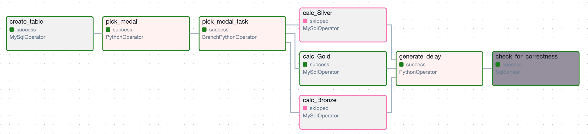

# HW | Apache Airflow 

## Step-by-Step Instructions for Completing the Task

### Write a DAG with the Following Tasks (Each Point → One Task)

### 1. Create a Table
- Use `IF NOT EXISTS` with the following fields:
  - `id` (auto-increment, primary key)
  - `medal_type`
  - `count`
  - `created_at`

### 2. Randomly Select a Value
- Choose one of the three values `['Bronze', 'Silver', 'Gold']` at random.

### 3. Conditional Branching
- Based on the selected value, trigger one of the following three tasks.

### 4. Description of the Three Tasks
1. Count the number of records in the table `olympic_dataset.athlete_event_results` where the `medal` field contains `Bronze`, and write the resulting count to the table created in step 1, along with the medal type and the record's creation time.
2. Count the number of records in the table `olympic_dataset.athlete_event_results` where the `medal` field contains `Silver`, and write the resulting count to the table created in step 1, along with the medal type and the record's creation time.
3. Count the number of records in the table `olympic_dataset.athlete_event_results` where the `medal` field contains `Gold`, and write the resulting count to the table created in step 1, along with the medal type and the record's creation time.

### 5. Add a Delay
- Use the `PythonOperator` with the function `time.sleep(n)` to create a delay for the next task if one of the previous three tasks executes successfully.

### 6. Use a Sensor for Validation
- Use a sensor to check whether the newest record in the table created in step 1 is no older than 30 seconds compared to the current time. The goal is to confirm that a record has actually been written to the table.
- Create a 35-second delay in step 5 to ensure the sensor fails if the delay exceeds 30 seconds.

---

## Criteria for Homework Acceptance and Evaluation

1. **Table Creation (10 points)**  
   Create a table using the provided specifications.

2. **Random Value Generation (10 points)**  
   Randomly generate a value from `['Bronze', 'Silver', 'Gold']`.

3. **Branching (15 points)**  
   Implement conditional logic to execute one of three tasks based on the selected value.

4. **Task Execution (25 points)**  
   Count the number of records in the specified table and save the results appropriately.

5. **Execution Delay (15 points)**  
   Implement a delay for the next task using `PythonOperator`.

6. **Record Validation (25 points)**  
   Validate the newest record in the table is no older than 30 seconds using a sensor.

## TASK RESULTS

### 1. General structure of the DAG

- Граф складається з наступних 5 завдань:
     - **create_medal_table**:
         - Опис: Створення таблиці в БД або перевірка, чи така таблиця вже існує.
         - Статус: success -таблиця створена успіщно.
     - **select_medal**:
         - Опис: Випадковий вибір медалі з трьох можливих (Gold, Silver, Bronze).
         - Статус: success - виконано вибір медалі.
     - **branch_task**:
         - Опис: Вибір гілки для підрахунку медалей залежно від обраного типу медалі.
         - Статус: success для однієї з гілок (count_gold_medals, count_silver_medals, або count_bronze_medals).
         В інших гілках завдання буде пропущено (skipped).
     - **delay_task**:
         - Опис: Затримка виконання на 20 секунд для імітації обробки даних.
         - Статус: success - завдання завершено із затримкою.
     - **check_recent_record**:
         - Опис: Перевірка,чи найновіший запис у таблиці neo_data.lesia_soloviova_medal_counts не старший за 30 секунд.
         - Статус: success - якщо запис знайдено в таблиці, якщо ні - failed
#### Висновки:
Завдання create_medal_table, select_medal, і одна з гілок підрахунку медалей завершуються успішно.
Завдання delay_task виконується незалежно від попередніх завдань.
Завдання check_recent_record може завершитися зі статусом failed, якщо новий запис не з'явився в таблиці в межах тайм-ауту.

### 2. GRID WITH DAG RESULTS

- На цьому гріді відображено результати виконнаня DAG:
    - *Всього запусків:* 18.
    - *Успішні запуски:* 2 (позначено зеленим кольором).
    - *Неуспішні запуски:* 16 (позначено червоним кольором).
    - *Дата та час першого запуску:* 2024-11-30, 16:55:10 UTC.
    - *Дата та час останнього запуску:* 2024-11-30, 19:10:19 UTC.
    - *Тривалість запусків:*
      - Максимальна: 00:03:22.
      - Середня: 00:01:10.
      - Мінімальна: 00:00:06.

#### Висновки:
DAG виконується правильно за логікою, однак завдання verify_recent_record часто 
завершується невдачею (failed) через відсутність записів, що відповідають умовам 
перевірки в заданий час, бо було проведено багато експериментів.

### 3. DAG RESULTS IN DB

#### Висновки:
Цей скріншот демонструє, що таблиця була успішно створена, і під час запуску DAG результати обробки успішно записувалися до цієї таблиці.